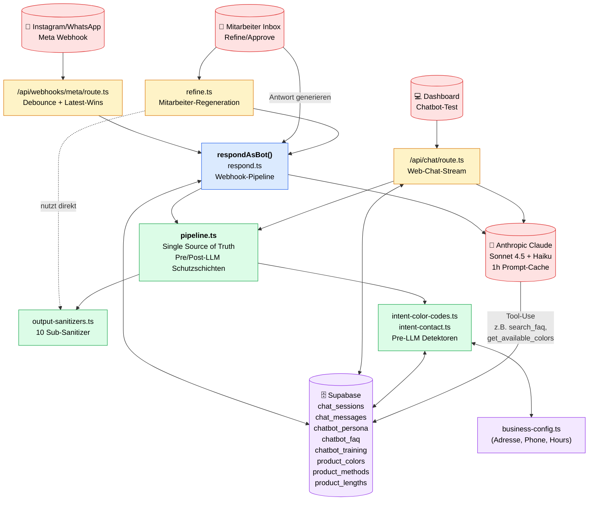
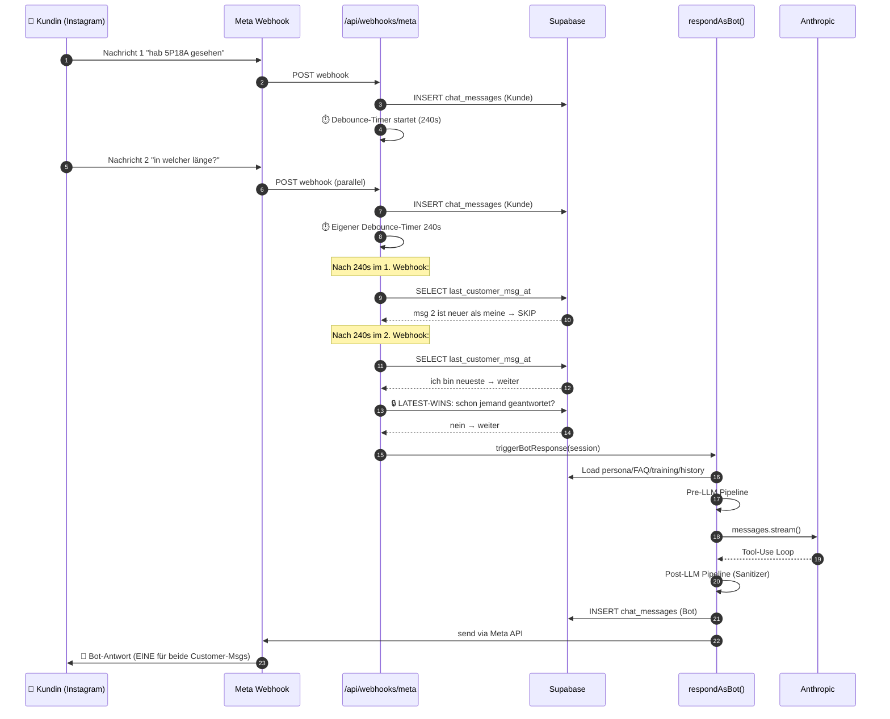
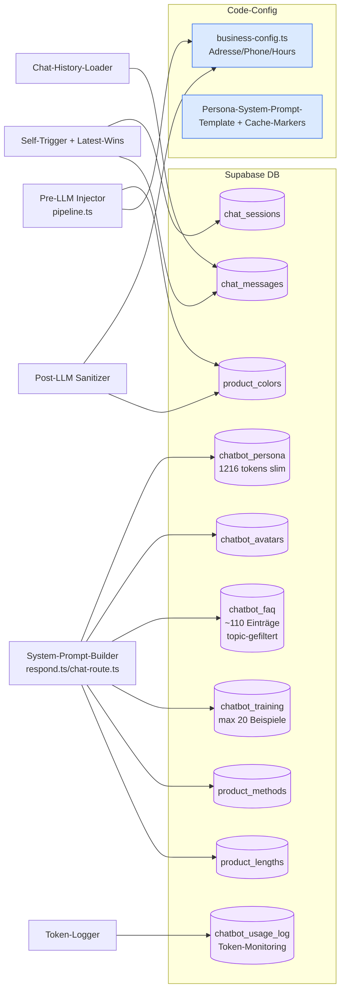
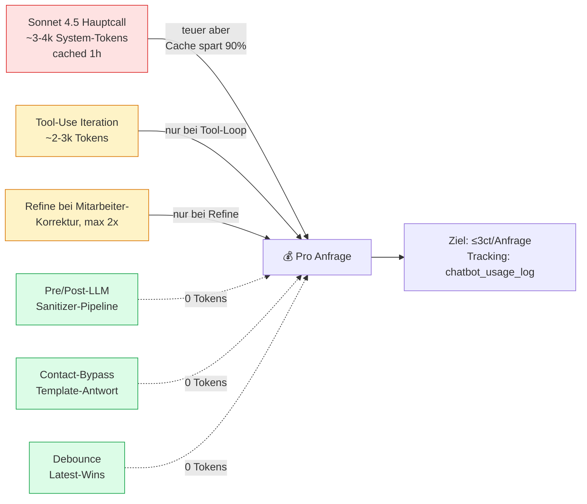

# Hairvenly Chatbot — Flow & Architektur (Live-Stand)

> Komplement zu [CHATBOT_ARCHITECTURE.md](./CHATBOT_ARCHITECTURE.md) — diese
> Datei zeigt **wie** alles zusammenhängt, jene zeigt **warum** so entschieden.
>
> Mermaid-Diagramme werden in GitHub, VS Code (mit Mermaid-Plugin), Obsidian
> und Cursor automatisch gerendert.

---

## 1. High-Level Architektur — wer ruft wen?



**Lesart:**
- **Gelb** = externer Trigger
- **Blau** = unsere Routes / Bot-Pipelines
- **Grün** = geteilte Module (Single Source of Truth)
- **Rot** = externe Services
- **Lila** = Datenquellen

---

## 2. Message-Flow im Webhook (Latest-Wins)



**Was hier strukturell garantiert ist:**
- Egal wie viele Customer-Messages innerhalb 240s kommen → es entsteht
  **immer genau eine Bot-Antwort** (Latest-Wins-Guard in webhooks/meta/route.ts).

---

## 3. Bot-Response-Pipeline (respondAsBot Detail)

```mermaid
flowchart TD
    classDef bypass fill:#fee2e2,stroke:#dc2626,color:#000
    classDef guard fill:#fef3c7,stroke:#d97706,color:#000
    classDef pre fill:#dbeafe,stroke:#2563eb,color:#000
    classDef llm fill:#e0e7ff,stroke:#4f46e5,color:#000
    classDef post fill:#dcfce7,stroke:#16a34a,color:#000
    classDef out fill:#f3e8ff,stroke:#9333ea,color:#000

    START([Eingang]) --> LOAD[Session laden<br/>aus DB]
    LOAD --> SELF{🚨 Letzte Bot-Msg<br/><30s alt?}
    SELF -.ja.-> BLOCK1[SKIP — kein neuer<br/>Customer-Trigger]:::guard
    SELF -->|nein| B2B{🏢 Gewerbe-Marker<br/>im Text?}
    B2B -.ja.-> FORCE[Force assisted+gewerbe-cat]:::guard
    B2B -->|nein| CONTACT{📞 Contact-Intent?<br/>Adresse/Phone/Email/Hours/Correction}
    FORCE --> CONTACT

    CONTACT -.match.-> TEMPL[<b>BYPASS</b><br/>Template aus<br/>business-config.ts<br/><i>0 Tokens, 0ms LLM</i>]:::bypass
    TEMPL --> SAVE_T[Save msg]
    SAVE_T --> END_T([Antwort])

    CONTACT -->|no match| PROMPT[System-Prompt bauen:<br/>Persona + Avatar +<br/>Methoden-Matrix +<br/>Geschäftszeit-Kontext +<br/>FAQ topic-filtered +<br/>Training-Beispiele]:::pre

    PROMPT --> PRELLM[<b>applyPreLlmContext</b><br/>pipeline.ts]:::pre
    PRELLM --> CC[Color-Code-Detect + DB-Lookup<br/>Inject als System-Block]
    CC --> STOCK[(TODO:<br/>Stock-Injector)]
    STOCK --> STYL[(TODO:<br/>Stylistinnen-Injector)]
    STYL --> LLM[<b>Anthropic Sonnet 4.5</b><br/>mit Tools:<br/>search_faq<br/>get_available_colors<br/>get_stock_eta<br/>request_handover]:::llm

    LLM --> TOOLLOOP{Tool-Use<br/>requested?}
    TOOLLOOP -.ja.-> TOOL[Tool ausführen,<br/>Result an LLM zurück]
    TOOL --> LLM
    TOOLLOOP -->|nein| TEXT[Bot-Text-Output]

    TEXT --> POSTLLM[<b>applyPostLlmSanitizers</b><br/>pipeline.ts]:::post
    POSTLLM --> EBF[enforceBusinessFacts<br/>Adresse/Phone/Email aus Config]
    EBF --> VNC[validateNegativeClaims<br/>Method×Length-Lügen +<br/>Linien-Exklusivitäts-Lügen<br/>strippen]
    VNC --> AAOS[applyAllOutputSanitizers<br/>siehe Detail unten]

    AAOS --> RESP[respond.ts-spezifisch:<br/>sanitizeStockLeaks<br/>ETA-Linien-Validator<br/>Ephemeral-Sanitizer]:::post

    RESP --> MODE{Bot-Modus?}
    MODE -->|auto| SEND[Send via Meta API]:::out
    MODE -->|assisted| DRAFT[Save als Pending Draft<br/>Mitarbeiter approved]:::out
    SEND --> DBSAVE[(INSERT chat_messages)]
    DRAFT --> DBSAVE
    DBSAVE --> ENDE([Fertig])
```



---

## 4. Post-LLM Sanitizer-Chain im Detail (applyAllOutputSanitizers)

```mermaid
flowchart LR
    classDef step fill:#dcfce7,stroke:#16a34a,color:#000

    IN([Bot-Output roh]) --> S1[stripSelfRef-<br/>Disclaimer<br/><i>Klammer-Disclaimer<br/>am Ende</i>]:::step
    S1 --> S2[stripProactive-<br/>PhotoOffer<br/><i>Nur reaktiv erlaubt</i>]:::step
    S2 --> S3[scrubWeekendTrap<br/><i>"morgen" am Fr→Mo</i>]:::step
    S3 --> S4[scrubClosed-<br/>Handover<br/><i>"gleich" außerhalb<br/>Geschäftszeit</i>]:::step
    S4 --> S5[scrubSupplier-<br/>Names<br/><i>Amanda/Eyfel<br/>Tabu</i>]:::step
    S5 --> S6[stripColorUrl-<br/>Mismatch<br/><i>TAUPE vs<br/>SMOKY TAUPE</i>]:::step
    S6 --> S7[autoAddColorUrls<br/><i>Farbnamen → URL</i>]:::step
    S7 --> S8[limitUrls<br/><i>max 3/Antwort</i>]:::step
    S8 --> S9[stripRedundant-<br/>FollowupQuestion<br/><i>"Welche Methode?"<br/>nach Liste</i>]:::step
    S9 --> S10[stripMarkdown-<br/>Formatting<br/><i>**bold** weg<br/>_italic_ weg</i>]:::step
    S10 --> S11[emDashBrake<br/><i>Em-Dash-Tic<br/>begrenzen</i>]:::step
    S11 --> OUT([Bot-Output<br/>sanitized])
```

Diese Kette läuft **identisch** in beiden Pipelines (Webhook + Web-Chat),
weil sie über `pipeline.ts::applyPostLlmSanitizers` aufgerufen wird.

---

## 5. Wann greift welche Schicht? (konkrete Fälle)

| Was die Kundin schreibt | Wer greift | Ergebnis |
|---|---|---|
| „Wo seid ihr?" | **Contact-Bypass** | Template, 0 LLM-Call, 0 Tokens |
| „Hans-Bernhard-Str. richtig?" | **address_correction** (Sibling) | "Fast 💕 — wir sind in Hans-Böckler…" |
| „Habt ihr 5P18A?" | **Color-Code-Injector** (Pre-LLM) | DB-Liste als Kontext → Bot zählt nur Treffer |
| „Tape 65cm gibt's nicht?" (Bot-Lüge) | **validateNegativeClaims** (Post-LLM) | Lüge wird gestrippt |
| „nur in russisch?" (Bot-Lüge bei beiden Linien) | **Line-Exclusivity-Check** (Sibling) | Strippen |
| Bot schreibt `**Bold**` | **stripMarkdownFormatting** | Sterne weg, WhatsApp-tauglich |
| Bot: „Welche Methode suchst du?" nach Liste | **stripRedundantFollowupQuestion** | Frage weg |
| Customer schickt 3 Msgs in 90s | **Latest-Wins-Guard** | 1 Bot-Antwort, nicht 3 |
| Customer: „bin Friseurin, Gewerbe?" | **B2B-Detector** | Niemals Autobot, Mitarbeiter-Pflicht |
| Customer schickt Audio | **Audio-Bypass** | Statische süße Antwort |

---

## 6. Datenfluss — was wird woher geladen?



---

## 7. Aktuelle Schutz-Inventur (Stand 2026-05)

### Pre-LLM (entscheidet/injiziert BEVOR der Bot generiert)

| Schicht | Status | Datei |
|---|---|---|
| Contact-Intent-Bypass (Adresse/Phone/Email/Hours) | ✅ + Korrektur-Varianten | `intent-contact.ts` |
| Color-Code-Injector (5P18A, 2T18A, …) | ✅ | `intent-color-codes.ts` |
| Methoden×Längen-Matrix in System-Prompt | ✅ | `respond.ts::loadProductCatalog` |
| Geschäftszeit-Kontext (open/closed/closing_soon) | ✅ | `business-hours.ts` |
| B2B-Detector → Force assisted | ✅ | `respond.ts` |
| Self-Trigger-Guard (<30s) | ✅ | `respond.ts` |
| Latest-Wins (90s/240s Debounce + DB-Check) | ✅ | `webhooks/meta/route.ts` |
| **Stock-Injector** | ❌ TODO | — |
| **Stylistinnen-Namen-Injector** | ❌ TODO | — |
| **Preise-Injector** | ❌ TODO | — |

### Post-LLM (korrigiert NACH dem Bot)

| Schicht | Was | Datei |
|---|---|---|
| enforceBusinessFacts | Adresse/Phone/Email/Hours gegen Config | `intent-contact.ts` |
| validateNegativeClaims | Method×Length + Linien-Exklusivität | `intent-color-codes.ts` |
| stripSelfRefDisclaimer | Klammer-Disclaimer | `output-sanitizers.ts` |
| stripProactivePhotoOffer | Foto-Angebot nur reaktiv | `output-sanitizers.ts` |
| scrubWeekendTrap | „morgen" am Fr→Mo | `output-sanitizers.ts` |
| scrubClosedHandover | „gleich" außerhalb Geschäftszeit | `output-sanitizers.ts` |
| scrubSupplierNames | Amanda/Eyfel-Tabu | `output-sanitizers.ts` |
| stripColorUrlMismatch | URL passt nicht zur Farbe | `output-sanitizers.ts` |
| autoAddColorUrls | Farbname → URL | `output-sanitizers.ts` |
| limitUrls | max 3/Antwort | `output-sanitizers.ts` |
| stripRedundantFollowupQuestion | 6 Pattern (Welche/Möchtest/Soll ich…) | `output-sanitizers.ts` |
| stripMarkdownFormatting | `**bold**`, `_italic_` | `output-sanitizers.ts` |
| emDashBrake | Em-Dash-Begrenzung | `output-sanitizers.ts` |
| sanitizeStockLeaks (respond-only) | konkrete Lagerzahlen | `respond.ts` |
| ETA-Linien-Validator (respond-only) | Datum-zu-Linie-Mapping | `respond.ts` |

### Risk-Categories — niemals Autobot

| Kategorie | Was passiert | Datei |
|---|---|---|
| `color_advice` | Bypass `isHighConfidence` → Draft | `webhooks/meta/route.ts` |
| `gewerbe` | Bypass + Force assisted + UI-Warning | `webhooks/meta/route.ts` + `respond.ts` |
| `appointment` | Hard-Rule Treatwell-only (eingebettet auf hairvenly.de/pages/termin-vereinbaren) | System-Prompt |

---

## 8. Wo das System Geld kostet (Cost-Modell)



**Hebel die schon gezogen sind:**
- Persona-Trim 5167 → 1216 Tokens (-76%)
- 1h Prompt-Cache statt 5min (Anthropic-Default seit März 2026)
- Refine-Limit max 2 Iterationen
- FAQ topic-gefiltert statt Vollkatalog
- Contact-Bypass spart komplette LLM-Calls bei Adressfragen

**Hebel die noch offen sind:**
- Cheap-LLM-Filter (Haiku-Pre-Routing für triviale Fragen)
- RAG statt FAQ-Vollload (Task #122 Phase 1)

---

## 9. Wartungs-Konvention

Wer diese Datei aktuell hält:
- Bei jedem strukturellen Fix wird `§7 Schutz-Inventur` ergänzt
- Bei neuem Pre/Post-LLM-Layer wird Diagram §3 erweitert
- Bei Risk-Category-Änderung wird §7-Tabelle "Risk-Categories" gepflegt
- Bei Cost-Hebel-Änderung wird §8 aktualisiert

Wenn dieser Stand nicht mehr stimmt → entweder Datei pflegen oder
Eintrag erweitern. Veraltete Architekturdokumentation ist gefährlich
(Vertrauen ohne Wahrheit).
